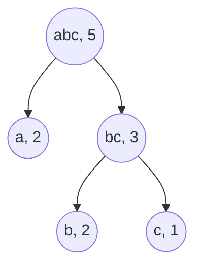
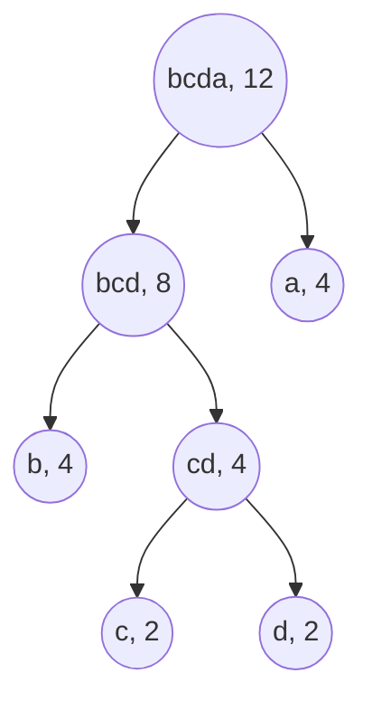
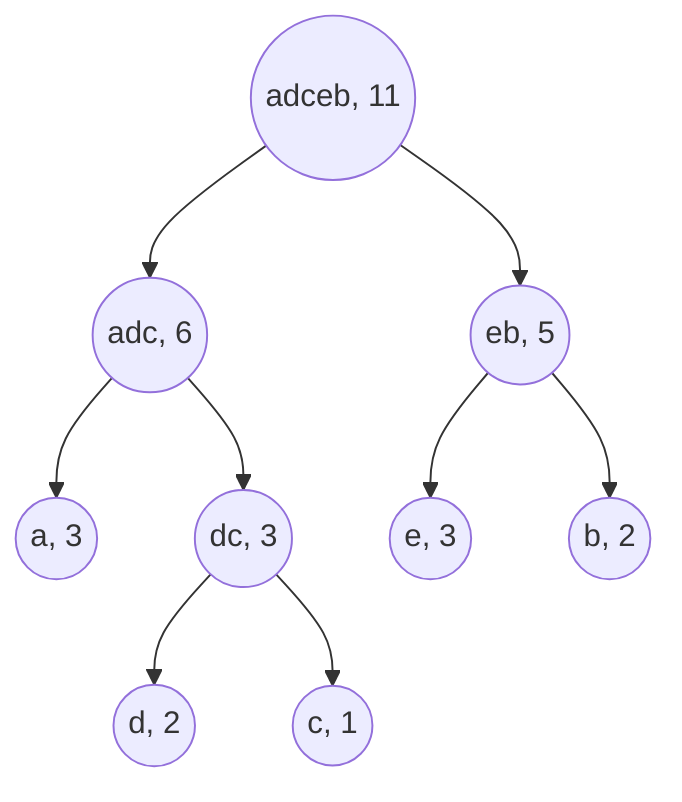
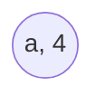

# Huffman coding

## Purpose

The following coding exercises are designed to test your knowledge of the following concepts:

* Huffman coding

## Overview

The coding exercises cover the following practical problems:
* Creating a Huffman coding for a given corpus (text)
* Using Huffman coding to encode a message
* Using Huffman coding to decode a message

## Coding exercises

### Exercise 1: Creating a Huffman coding for a given corpus (text)

Your task is to implement the following function to return Huffman coding for a given text:

```python
class TreeNode:
    """Class that represents nodes that would be used to create a Huffman coding.
    
    NOTE: you may augment this class if needed (i.e., add some methods or attributes); however,
    the initial constructor should still work.
    """

    def __init__(self, character: str = None, left: "TreeNode" = None, right: "TreeNode" = None):
        self.character = character
        self.left = left
        self.right = right


def create_huffman_coding(text: str) -> TreeNode:
    """Returns the root of the resulting Huffman coding tree.

    NOTE: `text` consists of `string.ascii_lowercase` symbols only.

    NOTE: `ALPHABET_SIZE` or `A` will be used to denote the number of distinct characters in a given text.
    NOTE: `N` will be used to denote the size of a given text.

    Two steps are required to build a Huffman coding based on a given text:
    (1) Calculate and order character frequencies/counts
    (2) Build a tree that represents the resulting Huffman coding

    NOTE: the expected time complexity for the first step is O(N + A * log(A))
    NOTE: the expected time complexity for the second step is O(A * log(A))

    Example: 
        (0) text="cabbaa"
        (1) character counts = [("a", 3), ("b", 2), ("c", 1)]

    NOTE: if the frequencies for some characters (nodes) are the same, order those characters lexicographically.

        (2)     ("abc", 5)
                |  \
                |   \
                |    \
            ("a", 3)  ("bc", 3)
                        |     \
                        |      \
                    ("b", 2)  ("c", 1)
            
            "a" -> "0"
            "b" -> "10"
            "c" -> "11"

    Args:
        text: str, a given text that should be used to build the Huffman coding
    Returns:
        TreeNode, the root of the resulting Huffman coding
    """
    pass
```

**Example 1:**

`text`="cabbaa"

Expected output:



The resulting Huffman coding:
* "a" -> "0"
* "b" -> "10"
* "c" -> "11"

**Example 2:**

`text`="aaaabbbbccdd"

Expected output:



The resulting Huffman coding:
* "a" -> "1"
* "b" -> "00"
* "c" -> "010"
* "d" -> "011"


**Example 3:**

`text`="abcabdedeea"

Expected output:



The resulting Huffman coding:
* "a" -> "00"
* "b" -> "11"
* "c" -> "011"
* "d" -> "010"
* "e" -> "10"


**Example 4:**

`text`="aaaa"

Expected output:



The result Huffman coding:
* "a" -> "0"

<br>

Please use the template `tasks/huffman.py:create_huffman_coding` for the implementation.

### Exercise 2: Encode a given message using Huffman coding

Your task is to implement the following function to encode a given message using Huffman coding:

```python
def encode_huffman(text: str, huffman_coding_root: TreeNode) -> str:
    """Returns an encoded message using Huffman coding for a given text.

    NOTE: `text` consists of `string.ascii_lowercase` symbols only.

    Args:
        text: str, a given text to encode
        huffman_coding_root: TreeNode, the root node that represents a given Huffman coding
    Returns:
        str, the encoded text
    """
    pass
```

**Example 1:**

`text`="abacaba"

`huffman_coding_root`=


Expected output:

"0100110100"


**Example 2:**

`text`="abacaba"

`huffman_coding_root`=


Expected output:

"10010101001"


**Example 3:**

`text`="abacaba"

`huffman_coding_root`=


Expected output:

"001100011001100"


**Example 4:**

`text`="aaaa"

`huffman_coding_root`=


Expected output:

"0000"

<br>

Please use the template `tasks/huffman.py:encode_huffman` for the implementation.


### Exercise 3: Decode a given message using Huffman coding

Your task is to implement the following function to decode a given message using Huffman coding:

```python
def decode_huffman(text: str, huffman_coding_root: TreeNode) -> str:
    """Uses Huffman coding to return the decoded message for a given text.

    NOTE: `text` consists of `string.ascii_lowercase` symbols only.

    Args:
        text: str, a given text to decode
        huffman_coding_root: TreeNode, the root node that represents a given Huffman coding
    Returns:
        str, the decoded text
    """
    pass
```

**Example 1:**

`text`="0100110100"

`huffman_coding_root`=


Expected output:

"abacaba"


**Example 2:**

`text`="10010101001"

`huffman_coding_root`=


Expected output:

"abacaba"


**Example 3:**

`text`="001100011001100"

`huffman_coding_root`=


Expected output:

"abacaba"


**Example 4:**

`text`="0000"

`huffman_coding_root`=


Expected output:

"aaaa"

<br>

Please use the template `tasks/huffman.py:decode_huffman` for the implementation.
