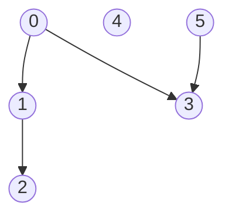

# Topological sorting

## Purpose

The coding exercise is designed to test your knowledge of the following concepts:

* Building topological sorting 
* Applying topological sorting to practical problems 

## Overview

The coding exercise covers the following practical problem:
* Finding an eligible task schedule that complies with dependencies

## Coding exercises

### Exercise 1: Finding an eligible task schedule that complies with task dependencies

Given the number of tasks `num_tasks` and `dependencies`, implement the function below to find the eligible task order. The dependency list `dependencies` consists of tuples with the numbers of two tasks, the second task can only be completed only after the first task. There is at least one eligible order. Tasks are enumerated from `0` to `num_tasks-1`.

```python
def find_task_order(num_tasks: int, dependencies: List[Tuple[int, int]]) -> List[int]:
    """
    Returns any appropriate order of tasks that complies with all dependencies.
    Tasks are enumerated from 0 to num_tasks-1.
    The dependency list consists of tuples with the numbers of two tasks, the second task can only be completed only after the first task.
    There is at least one eligible order.

    For example, you have five tasks from 0 to 4 and the dependency list [(0,1), (3,4), (4,1)].
    One of the eligible orders is [0, 3, 4, 1, 2].

    Parameters:
        num_tasks (int) : the number of tasks.
        dependencies (List[Tuple[int, int]]): the dependency list, which shows that the second task can only be done after the first.
    Returns
        List[int]: any appropriate task order that complies with the dependencies.
    """
    pass
```

**Example 1:**

`num_tasks = 6` 
`dependencies = [(0, 1), (1, 2), (0, 3), (5, 3)]`

These dependencies can be represented as a directed graph:



Possible eligible order: [5, 0, 1, 2, 3, 4]


**Example 2:**

`num_tasks = 6` 
`dependencies = [(0, 1), (1, 2), (2, 3), (3, 4), (4, 5)]`

Expected order: [0, 1, 2, 3, 4, 5]

<br/>

Please use the template `tasks/schedule:find_task_order` for the implementation.
